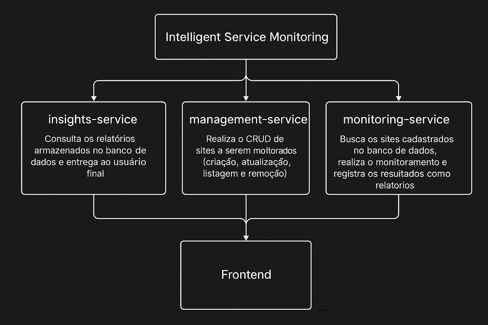

readme_content = """
# 📊 Intelligent Service Monitoring

**Intelligent Service Monitoring** é uma plataforma de monitoramento inteligente de serviços web, composta por **três APIs independentes** desenvolvidas com **FastAPI**. Utiliza **Docker** e **PostgreSQL** para gestão de dados e oferece funcionalidades avançadas, como a coleta de status de serviços e geração de relatórios  sobre a performance e a qualidade dos serviços monitorados.

---

## 🧩 Componentes do Sistema

### 1. `monitoring-service`
O **Monitoring Service** é responsável pelo monitoramento contínuo de URLs simulando serviços web.
- **Funções principais**:
  - Monitora periodicamente os serviços.
  - Mede o tempo de resposta de cada serviço.
  - Registra o status de cada serviço (online/offline).
  - Armazena todas as informações no banco de dados PostgreSQL.

### 2. `insights-service`
O **Insights Service** oferece uma interface para acessar e analisar os dados coletados pelo **Monitoring Service**.
- **Funções principais**:
  - Exibe o histórico de status de cada serviço monitorado.

### 3. `management-service`
O **Management Service** permite a gestão dos sites a serem monitorados.
- **Funções principais**:
  - Realiza operações CRUD (criação, atualização, listagem e remoção) de sites.
  - Interface simples para gerenciar os sites a serem monitorados pelo **Monitoring Service**.

---

## ⚙️ Tecnologias Utilizadas

- 🚀 **FastAPI** – Framework web para construir APIs rápidas e modernas.
- 🐘 **PostgreSQL** – Banco de dados relacional robusto para armazenamento dos dados.
- 🐳 **Docker + Docker Compose** – Contêineres para facilitar a execução e o gerenciamento dos serviços.
- 🛠️ **SQLAlchemy** – ORM para facilitar a interação com o banco de dados.

---

## 🚀 Como Rodar o Projeto

### Pré-requisitos

- **Docker**: Para a criação e gerenciamento de contêineres.
- **Docker Compose**: Para orquestrar os múltiplos serviços do projeto.

### Passos para Rodar Localmente

1. Clone o repositório:

    ```bash
    git clone https://github.com/seu-usuario/intelligent-service-monitoring.git
    cd intelligent-service-monitoring
    ```

2. Crie um arquivo `.env` na raiz do projeto com as variáveis de ambiente necessárias:

    ```env
    POSTGRES_DB=monitoramento
    POSTGRES_USER=postgres
    POSTGRES_PASSWORD=postgres
    POSTGRES_HOST=db
    POSTGRES_PORT=5432
    ```

3. Suba os contêineres:

    ```bash
    docker-compose up --build
    ```

4. Acesse os serviços:

    - **Monitoring Service**: [http://localhost:8000/docs](http://localhost:8000/docs)
    - **Insights Service**: [http://localhost:8001/docs](http://localhost:8001/docs)
    - **Management Service**: [http://localhost:8002/docs](http://localhost:8002/docs)
    - **Frontend**: [http://localhost:3000](http://localhost:3000)

---

## 📄 Licença

Este projeto é licenciado sob a licença **MIT**. Consulte o arquivo `LICENSE` para mais detalhes.

---

## 👨‍💻 Autor

Desenvolvido por **João Gabriel Vianna**.

---

## 🧠 Arquitetura do Sistema

A seguir, a representação da arquitetura dos serviços:


